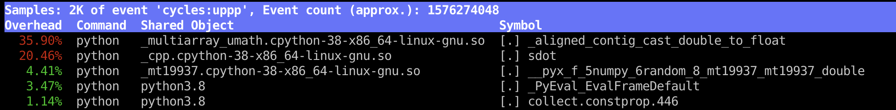
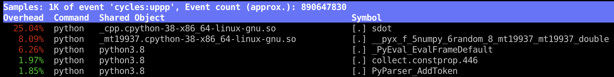
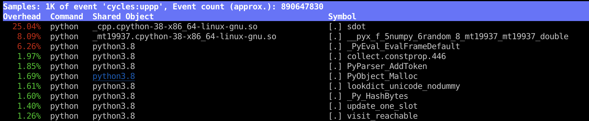

# Developing numerical C++ extension in Python using pybind11


## TL; DR
I've templated the (workable) best practice in the following package.
```bash
git clone --recursive https://github.com/xflash96/pybind11_package_example
```
Start from it and reference its README.md for the cheatsheet.

## Rationale
Python is dominant in the ML community. 
However, oftentimes we still need to optimize the critical path with C or C++ extensions (e.g., [pytorch/torch/csrc](https://github.com/pytorch/pytorch/tree/master/torch/csrc)). 
Although writing a C++ extension for Python has become much easier since the introduction of [pybind11](https://pybind11.readthedocs.io/), there are still many nuances. 
In this tutorial, we will go through an example numerical Python package with a C++ extension that you can easily write, profile, and publish.


## The package structure
The main component inside the [example package](https://github.com/xflash96/pybind11_package_example) has the following structure.
```bash
pybind11_package_example
├── setup.py                 # Flags and package dependencies
├── pybind11_package_example # The Python package
│   ├── __init__.py	      #    API definitions
│   └── models.py            #    Python implementation
├── src				      # The C++ extension
│   ├── solvers.cpp 	     #    C++ implementation
│   ├── solvers.h		    #    C++ header
│   └── pybind.cpp		   #    Bindings to Python
├── bin				      # Command-line entries
│   └── example_cmd
├── tests			        # Unit tests for Python and C++ API
│   ├── __init__.py
│   └── test_main.py		
└── third_party			  # External liberaries as Git submodules
    └── pybind11 
```
We place the Python code in `pybind11_package_example`, the C++ extension in `src`, command-line executables in `bin`, unit tests in `tests`, and third party libraries/headers in `third_party` as Git submodules.

## The Python Part
As a toy example, assume that we want to replace the core `matrix_vector_product` with a C++ extension.
In the Python code we expose the following API in `pybind11_package_example/__init__.py`
```python
from .models import matrix_vector_product
__all__ = ['matrix_vector_product']
```

And in the `pibind11_package_example/models.py`, we do all the checks, conversions and call the C++ extension.
As configured in `setup.py`, we compile the C++ part into an extension in `_cpp`, and call it by passing the NumPy array.
```python
import numpy as np
from . import _cpp

def matrix_vector_product(M, v):
    ''' Perform a matrix-vector product '''
    M = np.require(M, np.float32, 'C')          # Ensure M is a continuous float array
    v = np.require(v, np.float32, 'C')          # Ensure v is a continuous float array
    assert M.shape[1] == v.shape[0]             # Perform checks and conversion in Python

    x = np.zeros(M.shape[0], dtype=np.float32)  # Allocating output array in Python
    _cpp.matrix_vector_product(M, v, x)         # Call the function in C++
    return x                                    # Return the output array
```
To speed up development, I prefer only optimizing the critical path in C++ and leave everything else in Python.

## The CPP Extension
In `src/solvers.cpp`, we implement the `matrix_vector_product` by calling an optimized dot-product function `sdot`.
```cpp
// vector dot product: \sum_i x[i]*y[i];
float sdot(const float *x, const float *y, int l)
{
       //...
}

void matrix_vector_product(int m, int n, float * M, float * v, float * x)
{
    for (int i=0; i<m; i++)
        x[i] = sdot(M+i*n, v, n);
}
```
The code is in C fashion. Of course, you can also use 
[Eigen](https://pybind11.readthedocs.io/en/stable/advanced/cast/eigen.html)
or other C++ libraries you like. 
We expose the C++ interface in the header file `src/solvers.h`.
```cpp
void matrix_vector_product(int m, int n, const float *M, const float *v, float *x);
```

### Binding C++ to Python with pybind11
Now we provide the Python binding in `src/pybind.cpp`
```cpp
#include <pybind11/pybind11.h>
#include <pybind11/numpy.h>
using Tensor = pybind11::array;

// Get the float* pointer to the data
// Note: define different caster for different dtype in Numpy
float *FPTR(Tensor& a) { return (float*) a.mutable_data(); }

#include "solvers.h"

// Define the interface for the Python binding
// The Tensor arguments takes Numpy arrays (with the same underlying data pointer)
// Note that you can also use int / float / etc to 
void py_matrix_vector_product(Tensor M, Tensor v, Tensor x)
{
    int m = M.shape(0);
    int n = M.shape(1);

    matrix_vector_product(m, n, FPTR(M), FPTR(v), FPTR(x));
}

// Register a Python extension with EXTENSION_NAME (defined in setup.py
PYBIND11_MODULE(EXTENSION_NAME, m) {
    // bind `matrix_vector_product` in Python to the C++ function py_matrix_vector_product
    m.def("matrix_vector_product", &py_matrix_vector_product);
}
```
The `Tensor` class (actually, [`pybind11::array`](https://pybind11.readthedocs.io/en/stable/advanced/pycpp/numpy.html)) automatically takes the Python Numpy object and convert it to a CPP array. If done right, there is zero-copy for the underlying data between Numpy and C++. 
Also, the Tensor interface is pretty similar to that of PyTorch (as intended). So the code can easily be converted to a [PyTorch extension](https://pytorch.org/tutorials/advanced/cpp_extension.html) by changing `setup.py` and replacing the top part with the following.
```cpp
    #define EXTENSION_NAME TORCH_EXTENSION_NAME
    #include <torch/extension.h>
    using Tensor = torch::Tensor;
    float *FPTR(Tensor& a) { return a.data_ptr<float>(); }
```

## Building the extension and installing the package
Although this tutorial works without Docker, I strongly recommend setting-up a Docker environment for each project for maximum reproducibility. An example environment can be found in the `docker` directory of the package.

To build the extension alone when developing the C++ code, run
```bash
python setup.py build_ext -i
```
The above command invokes the [setup_helpers.py](https://github.com/pybind/pybind11/blob/master/pybind11/setup_helpers.py) in pybind11 to compile the extension using flags defined in `setup.py`.
If you prefer CMake in a more complex project, please refer to the [cmake_example](https://github.com/pybind/cmake_example).

Note that the package structure allows it to be run/imported without installation (under the main directory).
For system-wide installation, use
```bash
(sudo) `which python` setup.py develop # or
(sudo) `which python` setup.py install
```
Note that the `which python` above prevents the wrong install destination when the root uses a different python distribution.

## Profiling
To profile the C extension, I would recommend creating a Python command-line entry.
This is because most Python profiling tools support only Python input (you cannot pass `python -m ...` to the profiler.) We provide an example script in 
 `bin/example_cmd`, which benchmark the performance of the `matrix_vector_product` function.
```Python
#!/usr/bin/env python
import argparse
import timeit
import numpy as np
from pybind11_package_example import matrix_vector_product

def main():
    parser = argparse.ArgumentParser()
    parser.add_argument('--dtype', type=str, default='float32')
    args = parser.parse_args()
    args.m, args.n, args.iter, args.seed = 1000, 2000, 100, 1234

    np.random.seed(args.seed)
    M = np.random.rand(args.m, args.n).astype(args.dtype)
    v = np.random.rand(args.n).astype(args.dtype)

    print(f'running matrix vector product with m={args.m} n={args.n} (iter={args.iter})')
    t = timeit.timeit(lambda: matrix_vector_product(M, v), number=args.iter)
    print(f'average time: {t} sec')

if __name__ == '__main__':
    main()
```
The above code performs 100 rounds of matrix-vector product using `dtype` as the Numpy type.

### line_profiler
Now we profile the python part of the library using the  [line_profiler](https://github.com/pyutils/line_profiler). First, we add a `@profile` decorator to the functions we'd like to profile (remember to remove it afterward).
```python
@profile
def main():
```
To profile the script, run
```bash
kernprof -l ./bin/example_cmd
```
In the last line of the output, the profiler hints the result is written to `example_cmd.lprof`.
```console
running matrix-vector product with m=1000 n=2000 (iter=100)
average time: 0.008280581969302148 sec
Wrote profile results to example_cmd.lprof
```
Show the report of the result with
```bash
python -m line_profiler example_cmd.lprof
```
Then the profiler outputs the following
```console
Line #      Hits         Time  Per Hit   % Time  Line Contents
==============================================================
    14                                           @profile
    15                                           def main():
....
    26         1      21452.0  21452.0     20.2      M = np.random.rand(args.m, args.n).astype(args.dtype)
....
    30         1      83115.0  83115.0     78.4      t = timeit.timeit(lambda: matrix_vector_product(M, v), number=args.iter)
    31         1         37.0     37.0      0.0      print(f'average time: {t} sec')
```
Following the report, the critical path is indeed `matrix_vector_product`, so we will now profile the C++ extension.
### Perf
We use [perf](https://perf.wiki.kernel.org/index.php/Main_Page) from the Linux kernel to profile the C++ extension. It is a light-weight profiling tool utilizing the CPU performance counters, which means that it won't slow down the process too much. To enable perf, we need
```bash
sudo sh -c 'echo 1 >/proc/sys/kernel/perf_event_paranoid'
```

To record the function calls in the process, we do
```bash
perf record bin/example_cmd
```
And show the report with
```bash
perf report
```

#### Example: 
First, run `perf` with `--dtype=float64`, that is, setting the Numpy data type to be `double`.
```bash
perf record ./bin/example_cmd --dtype=float64
```
> running matrix vector product with m=1000 n=2000 (iter=100)<br />
> average time: 0.08063185098581016 sec<br />
> [ perf record: Woken up 1 times to write data ] <br />
> [ perf record: Captured and wrote 0.063 MB perf.data (1410 samples) ]


Then, we analyze the output with
```bash
perf report
```

The report shows that most of the time spent is on `_aligned_contig_cast_double_to_float` in a Numpy shared object,
that is, casting the float64 array to float.

Now, we run the command with `--dtype=float32`, that is, `float` in C++.
```bash
perf record ./bin/example_cmd --dtype=float32
```
> running matrix vector product with m=1000 n=2000 (iter=100)<br />
> average time: 0.33169691101647913 sec<br />
> [ perf record: Woken up 1 times to write data ]<br />
> [ perf record: Captured and wrote 0.102 MB perf.data (2420 samples) ]

Again show the report using
```bash
perf report
```

So without the type conversion, the critical path is on the `sdot` in our C++ extension.

We can further annotate the function by pressing `enter` on the `sdot`.


### Test
One advantage of the hybrid Python/C++ package is that we can test the underlying C++ code in Python. Here, we provide an example [unit test](https://docs.python.org/3/library/unittest.html) in `src/test_main.py`, which utilizes the Numpy `assert_allclose` to assert the array outputs.
```python
import unittest
import numpy as np
from numpy.testing import assert_allclose

import pybind11_package_example as mod
from pybind11_package_example import _cpp

class MainTest(unittest.TestCase):
    def test_matrix_vector_product(self):
        M = np.array([[1,2],[3,4.]])
        v = np.array([0.1, 0.2])
        x = mod.matrix_vector_product(M, v)
        ans = np.array([0.5, 1.1])

        assert_allclose(x, ans)

    def test_matrix_vector_product_cpp(self):
        M = np.array([[1,2],[3,4.]], dtype=np.float32)
        v = np.array([0.1, 0.2], dtype=np.float32)
        x = np.zeros(2, dtype=np.float32)
        _cpp.matrix_vector_product(M, v, x)
        ans = np.array([0.5, 1.1])

        assert_allclose(x, ans)
```
To run the test, we can use one of the following commands
```bash
python setup.py test # https://docs.python.org/3/library/unittest.html
pytest               # https://docs.pytest.org/en/latest/contents.html
```


### Publish the package
The users can always install the package via the Github URL, e.g.,
```bash
pip install https://github.com/xflash96/pybind11_package_example
```

If you like to publish the package to PyPI ([ref](https://packaging.python.org/tutorials/packaging-projects/)),
first use the following command to package it into a source distribution.
```bash
python setup.py sdist
```
Before uploading, please check the zip files in `dist/pybind11_package_example-0.0.1.tar.gz` indeed contains everything you need. You may need to modify the [`MANIFEST.in`](https://packaging.python.org/guides/using-manifest-in/) to include the missing source.

Once done, test the upload by
```
python -m twine upload --repository testpypi dist/* # and
pip install --index-url https://test.pypi.org/simple/ pybind11_package_example
```
If this works, rerun the command and remove the `--repository`.
This will upload it to the official PyPI.

## Reference
* I reference a lot from the post [Hybrid Python/C++ packages, revisited
](https://www.benjack.io/2018/02/02/python-cpp-revisited.html).
* You can also manipulate a Python object (e.g., use the Python list) in C++ using [`pybind11`](https://pybind11.readthedocs.io/en/stable/)! See the [cheatsheet](https://github.com/pybind/pybind11/issues/1201) to understand more about pybind11.
* For more examples on the Numpy interface in pybind11, see the [Git repo](https://github.com/tdegeus/pybind11_examples) and the [header file](https://github.com/tdegeus/pybind11_examples).
